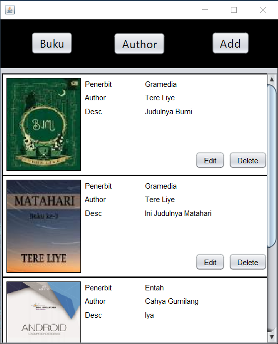
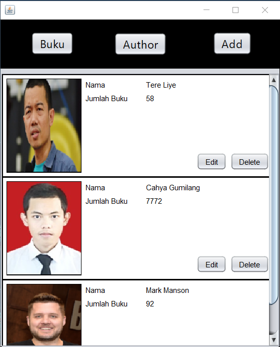
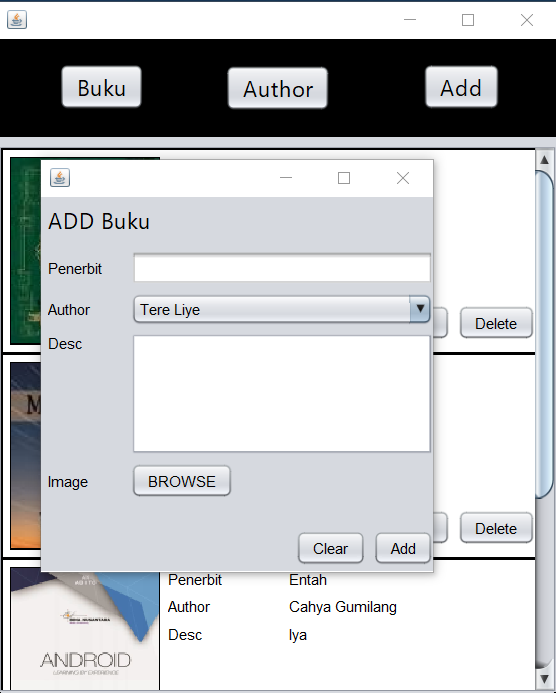
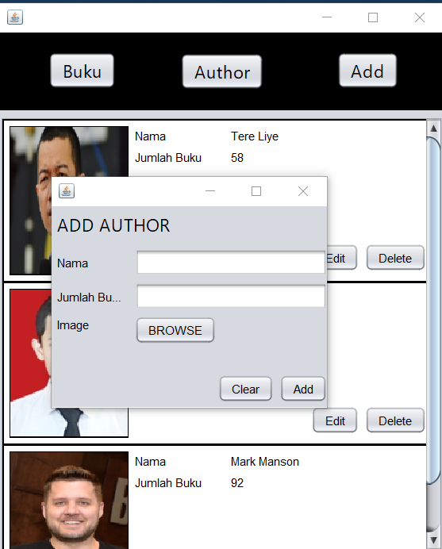
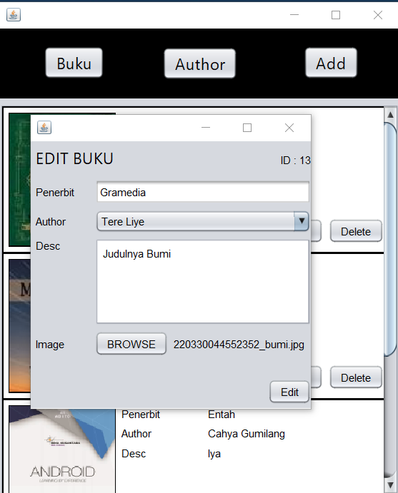
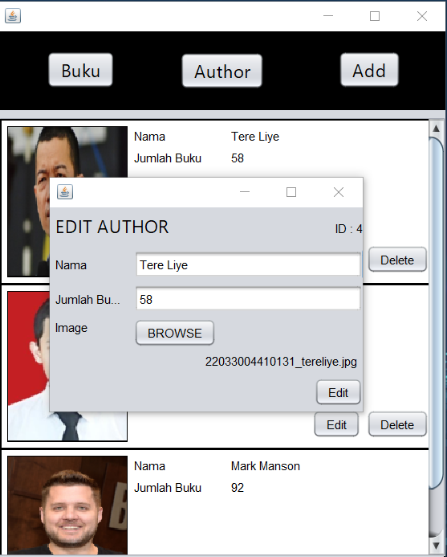
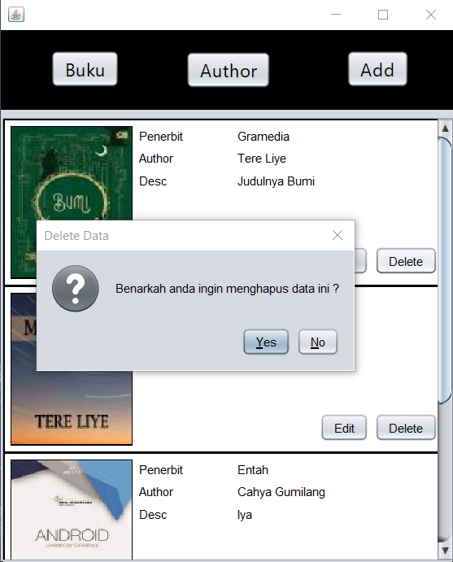

# TP1DPBO2022

>Saya Cahya Gumilang 2003128 mengerjakan tugas TP1 dalam mata kuliah Desain dan Pemrograman Berbasis Objek untuk keberkahanNya maka saya tidak melakukan kecurangan seperti yang telah dispesifikasikan. Aamiin

### Result
#### Switch Content
1. Button Buku

    
2. Button Author

    
#### Add Button
1. Content Buku Aktif

    
2. Content Author Aktif

    
#### Edit Buku

#### Edit Author

#### Delete
